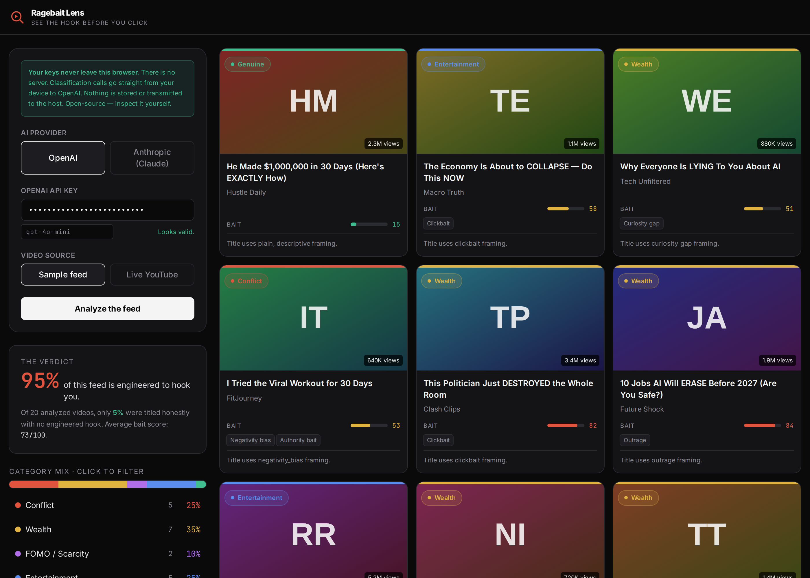

# Ragebait Lens

**See the hook before you click.**



Ragebait Lens reads the **title text** of real trending YouTube videos and sorts each
into the psychological category it's engineered to exploit — then shows you the math on
how little of your feed is actually honest.

> **One question, no other ask:** *How will you create your own content?*

**[Live demo](https://ragebait-lens.vercel.app)** · static site · client-side BYOK · open source

It is a static, single-page app. **There is no server.** Your AI key and your YouTube
key never leave your browser — classification requests go straight from your device to
OpenAI / Anthropic. That is the only design in which "zero-knowledge on the host's part"
is literally true. Don't trust the claim — read `src/classify.ts`.

## The taxonomy

Each video is placed in **exactly one** category (mutually exclusive):

| Category          | What it exploits                                                          |
| ----------------- | ------------------------------------------------------------------------ |
| **Conflict**      | Aggression, fear, mistrust, us-vs-them, outrage, ragebait                 |
| **Wealth**        | Money, power, status, influence, advantage over others                   |
| **FOMO / Scarcity** | Urgency, secrecy, "before it's too late", "nobody is talking about this" |
| **Entertainment** | Fun or informative but inert — you can't act on it                       |
| **Genuine**       | Honestly titled, no engineered hook. The unicorn — usually near-empty.    |

Plus non-exclusive **sub-tags** (the mechanisms layered into a title): clickbait,
curiosity gap, negativity bias, authority bait, parasocial, outrage, scarcity, superlative.

Each video also gets a **0–100 bait score** and a **one-sentence rationale** pointing at
the specific words in the title — so the classification is auditable, not a black box.
The model only reads title + channel text. It never watches the video and is instructed
not to invent content. That is what keeps the report non-hallucinated.

## Why "Genuine" is kept even though it's almost always empty

It's the punchline. Watching it sit at 2–4% while Conflict + Wealth + FOMO dominate is the
whole point: the algorithm doesn't reward honesty, it rewards the hook. Honest videos stay
invisible unless someone explicitly searches for them.

## Feed sources

The whole point is to read **your** feed, not a generic one. Pick a source in the setup panel:

| Source              | What it reads                                                        | Needs                          |
| ------------------- | ------------------------------------------------------------------- | ------------------------------ |
| **Sample**          | Built-in example titles. Great for a first look.                    | AI key only                    |
| **Trending**        | Today's `mostPopular` videos for a region.                          | AI key + YouTube key           |
| **By channel**      | Recent uploads from a channel handle/URL you actually watch.        | AI key + YouTube key           |
| **Playlist / URLs** | A public playlist URL, or video links pasted from your homepage.    | AI key + YouTube key           |
| **My subscriptions**| Newest uploads from channels you subscribe to (read-only sign-in).  | AI key + Google OAuth (no key) |

> YouTube's API can't return your personal recommendation feed directly. The closest
> organic reads are **By channel**, **Playlist / URLs** (paste links straight from your
> homepage), and **My subscriptions**. All of them read **title text only** — no login to
> this site, no screenshots, no OCR.

## Run locally

```bash
npm install
npm run dev
```

Open the local URL (default `http://localhost:5174`). Pick a provider, paste your OpenAI
(`sk-...`) or Anthropic (`sk-ant-...`) key, and click **Analyze the feed**. Start with the
built-in **Sample** source (no YouTube key needed) to see how it works.

### YouTube Data API key (Trending / By channel / Playlist)

Get a free [YouTube Data API v3 key](https://console.cloud.google.com/apis/library/youtube.googleapis.com):

1. In [Google Cloud Console](https://console.cloud.google.com/), create a project (a free
   personal Google account works best — Workspace accounts often block API keys).
2. Enable **YouTube Data API v3** for that project.
3. **Credentials → Create credentials → API key**, then paste it (`AIza...`).
4. **Restrict it:** Application restrictions → HTTP referrers (add your site and
   `localhost/*`), and API restrictions → YouTube Data API v3 only. This protects your
   free daily quota if the key ever leaks.

> **First time with Google Cloud Console?** The app ships with a full, friendly,
> screen-by-screen **Setup guide** page (link in the header) that walks a complete novice
> through every step below — enabling the API, creating and restricting the key, creating
> the OAuth client, Branding, Audience/test users — plus why the "unverified app" warning
> is normal and a good-faith liability disclaimer.

### Google sign-in (My subscriptions)

Reading your subscriptions needs a read-only OAuth grant instead of an API key. One-time setup:

1. Use the same Google Cloud project where YouTube Data API v3 is enabled.
2. **OAuth consent screen** → External → fill the basics → add your own Google address
   under **Test users** (so you can sign in while the app is unpublished).
3. **Credentials → Create credentials → OAuth client ID → Web application.** Under
   **Authorized JavaScript origins** add your site's address and
   `http://localhost:5174`. Copy the **Client ID** (only the ID — never a client secret).
4. In the app, choose **My subscriptions**, paste the Client ID, and click **Connect with
   Google**. The scope requested is `youtube.readonly`. The access token lives in memory
   for that tab only, is never stored, and you can revoke it anytime at
   [myaccount.google.com/permissions](https://myaccount.google.com/permissions).

## Share the verdict (not your feed)

After analyzing, a **Share the verdict** panel renders the aggregate result to a PNG you
can **download or copy to the clipboard**. The image contains numbers only — percentages,
average bait score, top tactics — and deliberately includes **no video titles or channels**.
Your personal feed stays private; the shareable artifact is just the data. Implemented
client-side with `<canvas>` in `src/verdictImage.ts`.

## Deploy

Static build, deploys anywhere. For Vercel: framework = Vite, build = `npm run build`,
output = `dist`. A `vercel.json` is included.

## Security notes (read these)

- Keys live only in React state (in memory) for the session. They are **not** written to
  `localStorage`, cookies, or any server.
- Because calls happen client-side, the keys are exposed to the page's JavaScript — so a
  tampered copy of this site *could* exfiltrate them. The defense is that this is
  open-source and auditable. Run it locally or from a deployment you trust, and use a
  scoped/limited key.
- The YouTube key is sent to Google's API from the browser; restrict it to the YouTube
  Data API and (ideally) your domain in the Google Cloud console.
- **My subscriptions** uses Google's client-side OAuth (implicit flow). It requests the
  read-only `youtube.readonly` scope, holds the token in memory only (never
  `localStorage`/cookies), and sends it directly from your browser to YouTube. It's
  optional — the other sources work without ever signing in to Google.

## Contributing

PRs welcome — see [CONTRIBUTING.md](CONTRIBUTING.md). The non-negotiables: never commit
secrets, keep it client-side, and read title text only.

## License

[MIT](LICENSE) — do what you want, just keep the notice.
